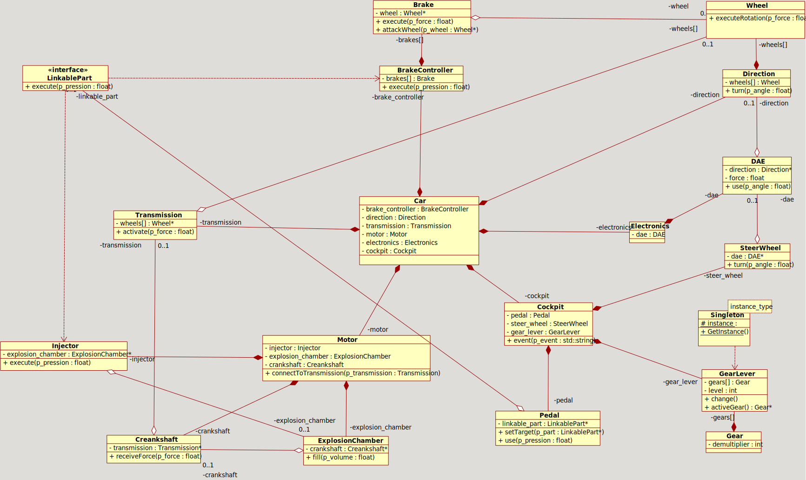
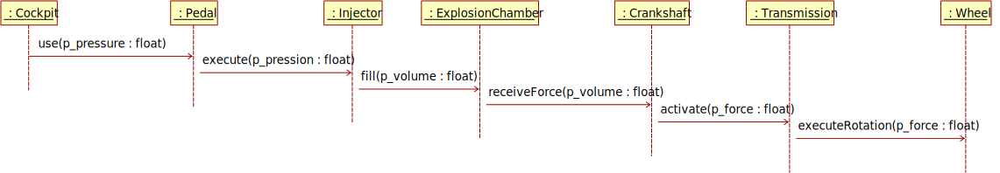
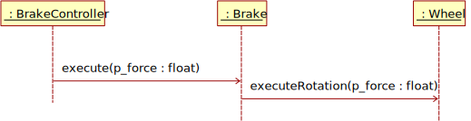
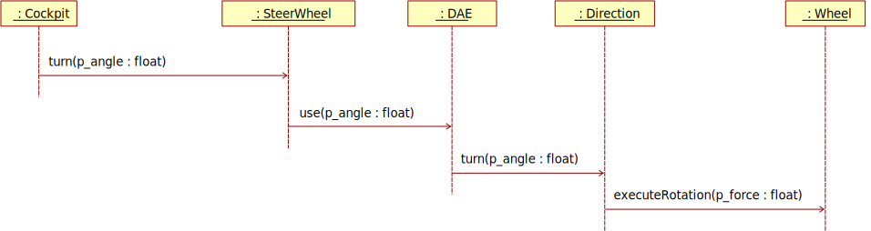
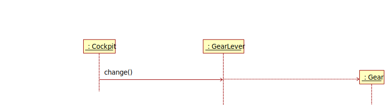

# **Car Composition Project with UML Diagrams**

---

## **Project Overview:**

This project aims to model the composition of a car system using Unified Modeling Language (UML) diagrams. The project includes the creation of a complex UML class diagram representing various objects and their relationships within the car system. Additionally, sequence diagrams are created to illustrate the interactions involved in accelerating, braking, steering, and changing gears.

## **Tools Used:**

- **Umbrello UML Modeller:** Umbrello is utilized to create and visualize the UML diagrams for this project. It provides a user-friendly interface for designing class diagrams and sequence diagrams.

## **UML Class Diagram:**

The UML class diagram depicts the structure of the car system, including classes, attributes, methods, and relationships. It provides a comprehensive overview of the objects involved and how they interact with each other.

#### Note:
    + Stands for public attributes

    # Stands for protected attributes

    - Stands for private attributes

***
## UML CLASS DIAGRAM

***

## Accelerating Sequence

***

## Braking Sequence

***

## Steering Sequence

***

## Change Gear Sequence

***

## **Objects and Relationships:**

1. **LinkablePart:**
   - Represents a part of the car system that can be linked to other parts.
   - Contains a method `execute(float p_pressure)`.

2. **Wheel:**
   - Represents a wheel of the car.
   - Contains a method `executeRotation(float p_force)`.

3. **Gear:**
   - Represents a gear in the car.
   - Contains an attribute `demultiplier` to store the gear demultiplier.

4. **GearLever:**
   - Represents the gear lever used for changing gears.
   - Inherits from `Singleton<GearLever>`.
   - Contains methods for changing gears and accessing the active gear.

5. **Transmission:**
   - Represents the car's transmission system.
   - Contains a vector of wheel objects and a method `activate(float p_force)`.

6. **Crankshaft:**
   - Represents the crankshaft of the car.
   - Contains a pointer to a Transmission object and a method `receiveForce(float p_volume)`.

7. **ExplosionChamber:**
   - Represents the explosion chamber of the car.
   - Contains a pointer to a Crankshaft object and a method `fill(float p_volume)`.

8. **Injector:**
   - Represents an injector in the car.
   - Inherits from `LinkablePart`.
   - Contains a pointer to an ExplosionChamber object and a method `execute(float p_pressure)`.

9. **Motor:**
   - Represents the motor of the car.
   - Contains objects of types Injector, ExplosionChamber, and Crankshaft.
   - Contains a method `connectToTransmission(Transmission* p_transmission)`.

10. **Pedal:**
   - Represents a pedal in the car.
   - Contains a pointer to a LinkablePart object.
   - Contains methods to set the target and use the pedal.

11. **Direction:**
   - Represents the direction system of the car.
   - Contains an array of Wheel objects and a method `turn(float p_angle)`.

12. **DAE (Dynamic Acceleration Enhancer):**
   - Represents a dynamic acceleration enhancer in the car.
   - Contains a pointer to a Direction object and a float variable force.
   - Contains a method `use(float p_angle)`.

13. **SteerWheel:**
   - Represents the steering wheel of the car.
   - Contains a pointer to a DAE object and methods to turn.

14. **Brake:**
   - Represents a brake in the car.
   - Contains a pointer to a Wheel object and methods to execute and attack a wheel.

15. **BrakeController:**
   - Represents the brake controller system of the car.
   - Inherits from LinkablePart.
   - Contains an array of Brake objects and a method to execute.

16. **Cockpit:**
   - Represents the cockpit of the car.
   - Contains objects of types Pedal, SteerWheel, and GearLever.

17. **Electronics:**
   - Represents the electronics system of the car.
   - Contains a DAE object.

18. **Car:**
   - Represents the car itself.
   - Contains objects of types BrakeController, Direction, Transmission, Motor, Electronics, and Cockpit.

***

## **Sequence Diagrams:**

Sequence diagrams illustrate the interactions between objects during specific scenarios such as accelerating, braking, steering, and changing gears. These diagrams provide a detailed view of the sequence of events and messages exchanged between objects.

**Conclusion:**

This project demonstrates the use of UML diagrams to model the composition of a car system. The UML class diagram provides a high-level overview of the system's structure, while sequence diagrams offer insights into the interactions between objects during different operations. Overall, the project showcases the power of UML as a modeling tool for complex systems.

---

#### Notes:

On the subject the cockpit should have an array of pedals, cars have more than one pedal.

---

### Resources: 

https://docs.kde.org/stable5/en/umbrello/umbrello/introduction.html

https://docs.kde.org/stable5/en/umbrello/umbrello/uml-elements.html

***
