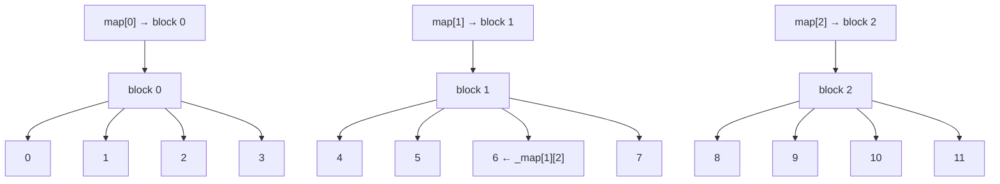

# Abstract Data

**Abstract Data** is a from-scratch reimplementation of the C++98 STL containers, following ISO 14882:1998 specifications.
It includes a **full testing suite** that compares this implementation (`ft::`) with the standard library (`std::`), as well as a **benchmarking system** with visual plotting.

---

## 📂 Project Structure

The core of the project lives in [`include/`](include), containing header-only implementations of all containers, iterators, and utilities:

```
include/
├── deque.hpp                     # ft::deque
├── list.hpp                      # ft::list
├── map.hpp                       # ft::map & ft::multimap
├── queue.hpp                     # ft::queue & ft::priority_queue
├── set.hpp                       # ft::set & ft::multiset
├── stack.hpp                     # ft::stack
├── vector.hpp                    # ft::vector
├── exception.hpp                 # Custom exceptions
├── utility.hpp                   # ft::pair, ft::make_pair
├── iterators/                    # Iterator classes
│   ├── bt_iterator.hpp               # Binary tree iterator
│   ├── deque_random_access_iterator.hpp
│   ├── iterator_traits.hpp
│   ├── list_bidirectional_iterator.hpp
│   ├── reverse_iterator.hpp
│   └── vector_random_access_iterator.hpp
└── utils/                        # Generic utilities
    ├── algorithm.hpp
    ├── enable_if.hpp
    ├── is_convertible.hpp
    ├── less.hpp
    ├── lexicographical_compare.hpp
    ├── node.hpp
    ├── rbt.hpp                      # Red-black tree
    ├── remove_const.hpp
    └── swap.hpp
```

These headers provide:

* **Sequence containers**: `vector`, `deque`, `list`
* **Associative containers**: `map`, `set`, `multimap`, `multiset`
* **Container adaptors**: `stack`, `queue`, `priority_queue`
* **Iterator implementations** (random access, bidirectional, reverse)
* **STL-like utilities**: `enable_if`, `lexicographical_compare`, `pair`, etc.

---

## 🚀 Getting Started

### 1. Clone and build everything

```bash
make
```

This will:

* Build the **ft** test binary (`test_suite/bin/ft.out`)
* Build the **std** reference binary (`test_suite/bin/std.out`)
* Build the benchmark binary (`benchmark.out`)

---

## 🧪 Testing

Run the tests comparing your containers to `std::`:

```bash
make test
```

Optionally specify number of test iterations:

```bash
./test_suite/bin/ft.out 1000
```

---

## 📈 Benchmarking

Run performance comparisons:

```bash
make benchmark
```

Generate and display plots (requires Python + matplotlib):

```bash
make plot
```

---

## 🛠 Makefile Targets

| Target           | Description                                |
| ---------------- | ------------------------------------------ |
| `make`           | Build all binaries                         |
| `make test`      | Run test suite against both ft:: and std:: |
| `make benchmark` | Run benchmark binary                       |
| `make plot`      | Generate benchmark plots (Python)          |
| `make venv`      | Create Python virtual environment          |
| `make install`   | Install Python requirements                |
| `make clean`     | Clean object files in test suite           |
| `make fclean`    | Clean everything (binaries, plots, CSVs)   |
| `make re`        | Rebuild everything                         |

---

## 📜 Example

Example: testing `ft::vector` vs `std::vector` for 100 iterations

```bash
./test_suite/bin/ft.out 100
./test_suite/bin/std.out 100
```

---

## 📖 Reference

### Understanding `iterator_traits`

> Use `iterator_traits<T>` when you don’t own or define the iterator `T`.

When writing your own iterator class (`random_access_iterator`), you define the traits directly.
When adapting or writing generic code (`reverse_iterator`, algorithms), use `iterator_traits` to support raw pointers and any iterator type.

*(See detailed explanation and code in the [Iterator Traits Guide](docs/iterator_traits.md) — or inline in README if you want to keep it here.)*

---

## About deque implementation...

## 📦 Overview

Unlike `std::vector`, which stores elements in contiguous memory, a `std::deque` (and this implementation) uses a segmented structure:

- The **map** is an array of pointers to memory blocks (`T*`).
- Each **block** stores a fixed number of elements (`BLOCK_SIZE`).
- Elements are stored sequentially across blocks.

This iterator allows seamless iteration and random access by maintaining:
- `pointer* _map` — a pointer to the block map (array of `T*`).
- `std::size_t _map_index` — the index of the current block in the map.
- `std::size_t _block_offset` — the index within the current block.

## 🧠 Example

Assume a deque with 3 blocks of size 4, holding 12 elements from 0 to 11:


```
  Map:      +--------+--------+--------+
            | blk[0] | blk[1] | blk[2] |
            +--------+--------+--------+
               |        |        |
               v        v        v
            +----+    +----+    +----+
```

```
blk[0]    blk[1]    blk[2]
+----+    +----+    +----+
| 0  |    | 4  |    | 8  |
| 1  |    | 5  |    | 9  |
| 2  |    | 6  |    |10  |
| 3  |    | 7  |    |11  |
+----+    +----+    +----+

```

An iterator pointing to element `6` would have:
- `_map_index = 1`
- `_block_offset = 2`
- `_map[1][2] == 6`

### `deque_random_access_iterator` Diagram



## ✅ Use Case

This iterator is meant to be used internally in a `ft::deque<T>` implementation, enabling STL-compatible iteration while hiding the segmented layout from the user.


---

| Vector                          | Deque                            |
| ------------------------------- | -------------------------------- |
| Grows at one end                | Grows at both ends               |
| Double capacity on reallocation | Double map size and **recenter** |
| Uses single contiguous array    | Uses segmented block map         |
| Can't `push_front()`            | Supports both front/back ops     |


---

## 📌 Notes

* Fully C++98-compliant (except benchmarks, which use C++11 for convenience).
* Containers follow STL complexity guarantees and iterator validity rules.
* Red-black tree implementation supports `multi` containers by design.
* Benchmarks measure performance at sizes: 1K, 10K, 100K.
* In the official implementation, the tree is composed, not inherited:
  - https://github.com/gcc-mirror/gcc/blob/43949a5271b6c0b14076b736d0c609235d36f7df/libstdc%2B%2B-v3/include/bits/stl_map.h#L161

---