# Understanding When and Why to Use `iterator_traits`

In generic programming, especially when writing STL-like containers and iterators, it’s essential to understand the role of `iterator_traits` and **when you should or should not use it**.

This guide explains:

- What `iterator_traits` is
- Why it is used in `reverse_iterator`
- Why it is **not** used in `random_access_iterator`
- The general rule for when to use `iterator_traits`
- Code examples and analogies

---

## 📚 What Is `iterator_traits`?

`iterator_traits` is a traits class that extracts type information from an iterator type.  
It gives you access to:

- `value_type`
- `pointer`
- `reference`
- `difference_type`
- `iterator_category`

### Example:

```cpp
template <typename Iterator>
void foo(Iterator it) {
    typedef typename ft::iterator_traits<Iterator>::value_type T;
    ...
}
````

This allows `foo()` to work with both:

* Class iterators (`ft::random_access_iterator<T>`)
* Raw pointers (`T*`)

---

## 🧠 Why Use `iterator_traits` in `reverse_iterator`?

Because `reverse_iterator` is a **generic adapter** over any iterator type `Iter`:

```cpp
template <typename Iter>
class reverse_iterator {
public:
    typedef typename ft::iterator_traits<Iter>::value_type        value_type;
    typedef typename ft::iterator_traits<Iter>::reference         reference;
    typedef typename ft::iterator_traits<Iter>::pointer           pointer;
    typedef typename ft::iterator_traits<Iter>::difference_type   difference_type;
    typedef typename ft::iterator_traits<Iter>::iterator_category iterator_category;
};
```

This works for:

* `ft::random_access_iterator<T>`
* `const T*`, `T*` (raw pointers)
* Any future custom iterator class

### Why not `Iter::value_type`?

Because raw pointers like `int*` do **not** have member types like `value_type` or `reference`.

```cpp
// Invalid for raw pointer
typename int*::value_type // ❌ compiler error
```

Traits fix that:

```cpp
typename ft::iterator_traits<int*>::value_type // ✅ int
```

---

## 🧱 Why **Not** Use `iterator_traits` in `random_access_iterator`?

Your `ft::random_access_iterator<T>` **is the iterator being described**.

```cpp
template <typename T>
class random_access_iterator {
public:
    typedef T*       pointer;
    typedef T&       reference;
    typedef T        value_type;
    typedef std::ptrdiff_t difference_type;
    typedef std::random_access_iterator_tag iterator_category;
};
```

If you wrote this using `iterator_traits`:

```cpp
typedef typename ft::iterator_traits<T>::value_type value_type; // ❌ invalid
```

It assumes `T` is already an iterator — but in your case, it's the **value type**, like `int`.

So this would be a **circular, incorrect use** of traits.

---

## 🧠 Analogy: ID Cards

* `random_access_iterator<T>` is like **creating your own ID card**.
* `iterator_traits<Iter>` is like a **scanner that reads ID cards**.

### So:

* `random_access_iterator` defines the traits (name, age, etc.).
* `iterator_traits` is used by others (like `reverse_iterator`) to extract those traits.

---

## ✅ Summary: When to Use `iterator_traits`

| Scenario                        | Use `iterator_traits`? | Why?                                          |
| ------------------------------- | ---------------------- | --------------------------------------------- |
| Inside `random_access_iterator` | ❌ No                   | You're defining the iterator                  |
| Inside `reverse_iterator`       | ✅ Yes                  | You're adapting another iterator              |
| Inside algorithms (`advance`)   | ✅ Yes                  | To support any iterator type (pointer, class) |
| With raw pointers (`int*`)      | ✅ Yes                  | Only traits can describe them                 |

---

## 🧪 Sanity Check

This should work:

```cpp
ft::iterator_traits<ft::random_access_iterator<int> >::value_type // ✅ int
ft::iterator_traits<int*>::value_type                             // ✅ int
```

But this will fail:

```cpp
typename int*::value_type // ❌ compiler error: no such member
```

---

## ✅ Final Rule of Thumb

> Use `iterator_traits<T>` when you don’t *own* or *define* the iterator `T`.

But when you're *defining* the iterator class itself — **don't use `iterator_traits` inside it**.

---

# `deque_random_access_iterator`

A custom random access iterator for a segmented deque container, compatible with C++98 standards. This iterator supports full random access behavior (arithmetic, comparisons, dereferencing), while navigating a non-contiguous memory structure.

## 📦 Overview

Unlike `std::vector`, which stores elements in contiguous memory, a `std::deque` (and this implementation) uses a segmented structure:

- The **map** is an array of pointers to memory blocks (`T*`).
- Each **block** stores a fixed number of elements (`BLOCK_SIZE`).
- Elements are stored sequentially across blocks.

This iterator allows seamless iteration and random access by maintaining:
- `pointer* _map` — a pointer to the block map (array of `T*`).
- `std::size_t _map_index` — the index of the current block in the map.
- `std::size_t _block_offset` — the index within the current block.

## 🧠 Example

Assume a deque with 3 blocks of size 4, holding 12 elements from 0 to 11:


```
  Map:      +--------+--------+--------+
            | blk[0] | blk[1] | blk[2] |
            +--------+--------+--------+
               |        |        |
               v        v        v
            +----+    +----+    +----+
```

```
blk[0]    blk[1]    blk[2]
+----+    +----+    +----+
| 0  |    | 4  |    | 8  |
| 1  |    | 5  |    | 9  |
| 2  |    | 6  |    |10  |
| 3  |    | 7  |    |11  |
+----+    +----+    +----+

```

An iterator pointing to element `6` would have:
- `_map_index = 1`
- `_block_offset = 2`
- `_map[1][2] == 6`

## 🧮 Mermaid Diagram

```mermaid
graph TD
  A0["map[0] → block 0"] --> B0["block 0"]
  A1["map[1] → block 1"] --> B1["block 1"]
  A2["map[2] → block 2"] --> B2["block 2"]

  B0 --> C0["0"]
  B0 --> C1["1"]
  B0 --> C2["2"]
  B0 --> C3["3"]

  B1 --> C4["4"]
  B1 --> C5["5"]
  B1 --> C6["6 ← _map[1][2]"]
  B1 --> C7["7"]

  B2 --> C8["8"]
  B2 --> C9["9"]
  B2 --> C10["10"]
  B2 --> C11["11"]
```



## ⚙️ Operations Supported

| Operation            | Behavior                                                  |
| -------------------- | --------------------------------------------------------- |
| `++`, `--`           | Moves across blocks automatically                         |
| `+`, `-`, `+=`, `-=` | Jumps across blocks logically                             |
| `*`, `->`, `[]`      | Accesses correct element from `_map[_map_index][_offset]` |
| Comparisons          | Based on logical position across blocks                   |

## 🚫 Notable Constraints

* `BLOCK_SIZE` must match the underlying deque block size.
* Assumes the block map (`pointer* _map`) and block contents are valid.
* This iterator **cannot be reused** for `vector` or other containers.

## ✅ Use Case

This iterator is meant to be used internally in a `ft::deque<T>` implementation, enabling STL-compatible iteration while hiding the segmented layout from the user.


---

| Vector                          | Deque                            |
| ------------------------------- | -------------------------------- |
| Grows at one end                | Grows at both ends               |
| Double capacity on reallocation | Double map size and **recenter** |
| Uses single contiguous array    | Uses segmented block map         |
| Can't `push_front()`            | Supports both front/back ops     |


---

monkey tester is missing tests for the 3rth constructor, specially check for SFINAE implementation...

---