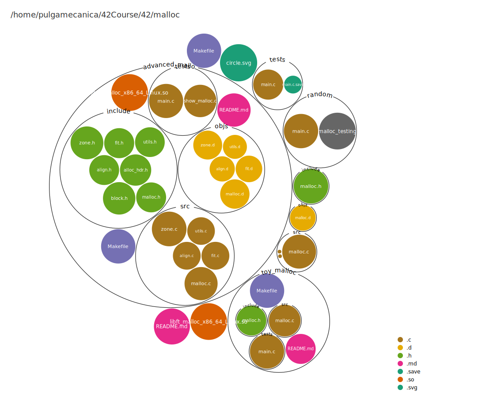

This malloc implementation represents a general purpose allocator. It should be space-concerving, portable, tunnable and relatively fast.
While it's not the best at each characteristic I described before, it balances each characteristic, making it an ideal solution for general purpose allocator.



```md
The main properties of the algorithms are:
* For large (>= 512 bytes) requests, it is a pure best-fit allocator,
  with ties normally decided via FIFO (i.e. least recently used).
* For small (<= 64 bytes by default) requests, it is a caching
  allocator, that maintains pools of quickly recycled chunks.
* In between, and for combinations of large and small requests, it does
  the best it can trying to meet both goals at once.
* For very large requests (>= 128KB by default), it relies on system
  memory mapping facilities, if supported.

> (source: https://github.com/ennorehling/dlmalloc/blob/71296436f979a350870e10b869ccfd28bfcc17e4/malloc.c#L41C3-L49C45)
```

---

> First when learning about `malloc` the very first thing that I was surprised to learn is about the overhead word "hidde" per chunk; i.e each time you use malloc it returns a pointer taken from the proecess virtual memory, where you can write (size_t)N bytes, and just before this pointer, adjacent lies a header word holding information about the allocation; namely, the status such as (size_t)N, and iterators.
>
> This will make malloc very fast when freeing the memory when you can access this headers.
>
> Also we can implement a simple circular doubled linked list which is super fast for insertion and deletion, given that we can access directly the iterator where we registered the memory address location in out memory map.

```txt
FACTS:
	In x_64bit systems, pointers or "addresses" are 8bytes (64bits) that means that we need 64 bits to represent a memory address.
	Ex: 0x0000000ffffff2
	The pointer refers to an address in the virtual memory where you can store 1 byte.
	Of course you might have permission to write in the following addresses (after the address in the virtual memory, so in that case you will be able to write N bytes, and still identify with a memory address the data you want to save)
	Ex: addr = 0x0000000ffffff2 (you can save 8 bits of data in the corresponding memory)
    /---------------------------\
    | 0  0  0  0 -  0  0  0  0  | 0x0000000ffffff3
    | 0  0  0  0 -  0  0  0  0  | 0x0000000ffffff2(addr)
    | 0  0  0  0 -  0  0  0  0  | 0x0000000ffffff1
    | 0  0  0  0 -  0  0  0  0  | 0x0000000ffffff0
    | 0  0  0  0 -  0  0  0  0  | 0x0000000fffffef
    \---------------------------/
```

---

### Caching, Splitting, Coalescing and preallocation

	"In the most straightforward version of the basic algorithm, each freed chunk is immediately coalesced with neighbors to form the largest possible unused chunk. Similarly, chunks are created (by splitting larger chunks) only when explicitly requested.

	Operations to split and to coalesce chunks take time. This time overhead can sometimes be avoided by using either of both of two caching strategies:

	Deferred Coalescing
	Rather than coalescing freed chunks, leave them at their current sizes in hopes that another request for the same size will come along soon. This saves a coalesce, a later split, and the time it would take to find a non-exactly-matching chunk to split.
	Preallocation
	Rather than splitting out new chunks one-by one, pre-split many at once. This is normally faster than doing it one-at-a-time.
	Because the basic data structures in the allocator permit coalescing at any time, in any of malloc, free, or realloc, corresponding caching heuristics are easy to apply.
	The effectiveness of caching obviously depends on the costs of splitting, coalescing, and searching relative to the work needed to track cached chunks. Additionally, effectiveness less obviously depends on the policy used in deciding when to cache versus coalesce them. .

	Caching can be a good idea in programs that continuously allocate and release chunks of only a few sizes. For example, if you write a program that allocates and frees many tree nodes, you might decide that is worth it to cache some nodes, assuming you know of a fast way to do this. However, without knowledge of the program, malloc cannot know whether it would be a good idea to coalesce cached small chunks in order to satisfy a larger request, or whether that larger request should be taken from somewhere else. And it is difficult for the allocator to make more informed guesses about this matter. For example, it is just as costly for an allocator to determine how much total contiguous space would be gained by coalescing chunks as it would be to just coalesce them and then resplit them.

	Previous versions of the allocator used a few search-ordering heuristics that made adequate guesses about caching, although with occasionally bad worst-case results. But across time, these heuristics appear to be decreasingly effective under real loads. This is probably because actual programs that rely heavily on malloc increasingly tend to use a larger variety of chunk sizes. For example, in C++ programs, this probably corresponds to a trend for programs to use an increasing number of classes. Different classes tend to have different sizes."
	[https://gee.cs.oswego.edu/dl/html/malloc.html](https://gee.cs.oswego.edu/dl/html/malloc.html)

---

### Fragmentation

	Internal fragmentation
	Rarely do processes require the use of an exact number of pages. As a result, the last page will likely only be partially full, wasting some amount of memory. Larger page sizes lead to a large amount of wasted memory, as more potentially unused portions of memory are loaded into the main memory. Smaller page sizes ensure a closer match to the actual amount of memory required in an allocation.
	[https://en.wikipedia.org/wiki/Page_(computer_memory)](https://en.wikipedia.org/wiki/Page_(computer_memory))


---

### Memory alignment

For any type `T`, the C standard defines an **alignment requirement** `A = alignof(T)`
Rule: an object of type `T` must be stored at an address that is a multiple of `A`.

So:

* If `A = 1`, the object can live anywhere.
* If `A = 2`, it must start at an even address.
* If `A = 4`, it must start at a multiple of 4.
* If `A = 8`, at a multiple of 8.
* etc.

---

# 🔹 ASCII examples

Imagine memory as a ruler of byte addresses. I’ll mark which addresses are valid (`^`) and which are invalid (`x`) for an object that requires a given alignment.

---

### 1-byte alignment (A = 1)

```
addresses:  ... 1000 1001 1002 1003 1004 1005 1006 1007 1008 ...
valid     :      ^    ^    ^    ^    ^    ^    ^    ^    ^
invalid   :     
```

✔ Every address works (chars, `uint8_t`, etc.).

---

### 2-byte alignment (A = 2)

```
addresses:  ... 1000 1001 1002 1003 1004 1005 1006 1007 1008 ...
valid     :      ^         ^         ^         ^         ^
invalid   :          x         x         x         x
```

✔ Valid at multiples of 2 (1000, 1002, 1004 …).
✘ Invalid at odd addresses.

---

### 4-byte alignment (A = 4)

```
addresses:  ... 1000 1001 1002 1003 1004 1005 1006 1007 1008 1009 1010 1011 1012 ...
valid     :      ^                   ^                   ^                   ^
invalid   :          x   x   x           x   x   x           x   x   x           x
```

✔ Valid at 1000, 1004, 1008, 1012 …
✘ Invalid at the three addresses in between.

---

### 8-byte alignment (A = 8)

```
addresses:  ... 1000 1001 1002 1003 1004 1005 1006 1007 1008 1009 1010 1011 1012 1013 1014 1015 1016 ...
valid     :      ^                                      ^                                       ^
invalid   :          x    x    x    x    x    x    x         x    x    x    x    x    x    x
```

✔ Valid at 1000, 1008, 1016 …
✘ Invalid at the 7 addresses in between.

---

# 🔹 Pattern

For alignment `A`:

* Valid addresses = multiples of `A`.
* Invalid addresses = `A − 1` between each valid one.

So the higher the alignment requirement, the more “gaps” there are where you can’t start an object of that type.

---

# 🔹 Why this matters for `malloc`

The C standard requires:

> “The pointer returned by `malloc` is suitably aligned for any object type.”

That means the pointer must be aligned to the strictest requirement on the platform.
In practice, that’s `alignof(max_align_t)`.

So if your platform’s `max_align_t` requires 16-byte alignment, then **every malloc result must be a multiple of 16**, no matter if the user requested 1 byte or 1000 bytes.

In practice, malloc doesn't care about types `T`, the address is the alignement it must follow, since the address of any type will still be just an address `*`.

---

# `max_align_t` in one sentence

`alignof(max_align_t)` is the **largest** alignment any fundamental scalar type on your platform requires.
If you align to that, you’re safe to place *any* type at the returned pointer.

---

From the manual:

```
If addr is NULL, then the kernel chooses the (page-aligned) address at which to create the mapping;
```

This is perfect, since the base pointer returned by mmap is already alligned, the issue arrises because we want to write the header in front of the addr returned to the user, so we can just padd the header untill we are alligned again, then the user returned address starts

##### References:

>`dlmalloc`: https://github.com/ennorehling/dlmalloc/blob/master/malloc.c (This is the best source I founded, here you can find all about how malloc works!!!)
>
>GNU ref: https://www.gnu.org/software/gnulib/manual/html_node/Glibc-malloc_002eh.html
>
>BSD ref: https://man.freebsd.org/cgi/man.cgi?malloc
>
>Linux ref: https://man7.org/linux/man-pages/man3/malloc.3.html
>
>`jmalloc`: https://github.com/jemalloc/jemalloc/blob/dev/src/jemalloc.c
>
>`malloc`: https://codebrowser.dev/glibc/glibc/malloc/malloc.c.html
>
>About dlmalloc: https://gee.cs.oswego.edu/dl/html/malloc.html
>
>Address Spaces: https://pages.cs.wisc.edu/~remzi/OSTEP/vm-intro.pdf
>
>Memory API: https://pages.cs.wisc.edu/~remzi/OSTEP/vm-api.pdf
>